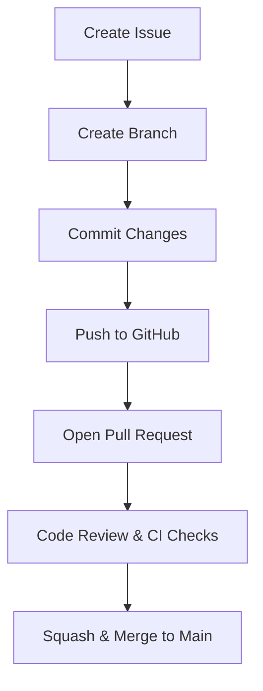
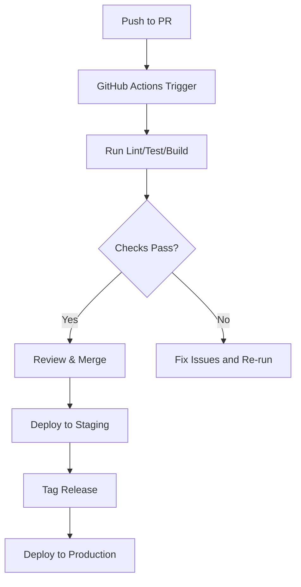

# Web IDE Display - Development Guidelines

## 🧭 Purpose

This document defines team-wide standards and workflows for contributing to the Web IDE Display project. It ensures onboarding is smooth, code quality is high, and our GitHub-based collaboration is efficient and professional.

---

## 🧑‍💻 Onboarding Guide

### 1. Get Access

- [ ] Request access to the GitHub repository.
- [ ] Join the team Slack/Discord for dev updates and discussion.
- [ ] Clone the project using:  
      `git clone git@github.com:org/web-ide-display.git`

### 2. Set Up Your Dev Environment

- [ ] Install Node.js (v18+ recommended)
- [ ] Install pnpm: `npm i -g pnpm`
- [ ] Run `pnpm install` in the root folder
- [ ] Copy `.env.example` to `.env.local` and fill out credentials as needed
- [ ] Start the app: `pnpm dev`

### 3. Understand the Project Structure

- `frontend/`: Next.js app with Monaco-based IDE
- `backend/`: REST and WebSocket servers
- `mcp/`: Master Control Program handling AI instructions

---

## 🌿 Git Workflow



### Branching

- Create a new branch per feature:  
  `git checkout -b feature/<short-desc>`
- Use prefixes: `feature/`, `fix/`, `chore/`

### Commit Messages

Use **Conventional Commits**:

- `feat: add save button`
- `fix: websocket reconnect logic`
- `chore: update dependencies`

### Pull Requests

- Open PRs against `main`
- Use draft PRs for early feedback
- Title should match intent (e.g., `feat: session replay UI`)
- Include screenshots or examples for UI changes
- Reference issues like: `Closes #42`

---

## 🔁 CI/CD



---

## 🗃 Repository Layout

```text
├── frontend/
│   ├── pages/
│   ├── components/
│   └── hooks/
├── backend/
│   ├── api/
│   └── ws/
├── mcp/
│   └── actions/
├── scripts/
├── public/
└── .github/
```

---

## 🧭 Summary

- ✅ Start from `main`, branch for each task
- ✅ Always write typed, tested, and documented code
- ✅ Create small PRs with context and clarity
- ✅ Discuss in issues before building
- ✅ Security, consistency, and communication above all

By following these guidelines, we build a professional, extensible, and secure project that others can trust and extend.
