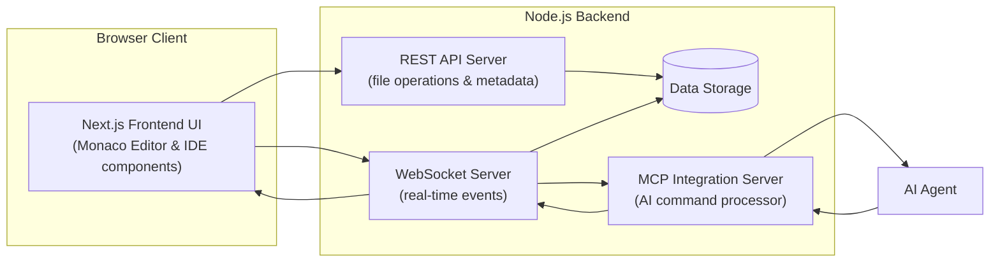
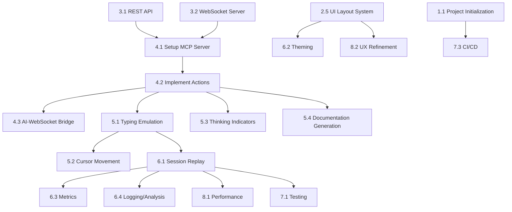

# Web IDE Display - Project Overview

## Introduction

The **Web IDE Display** is a web-based integrated development environment (IDE) interface that enables **AI-driven development** to be visualized in real-time. This project aims to simulate a human-like coding experience, where an AI agent writes and edits code within a browser-based IDE as if a human developer were at the keyboard. The interface includes a rich code editor, file explorer, terminal emulator, and other familiar IDE components, all orchestrated by an AI agent via a specialized server. ...

## Project Purpose and Goals

The primary purpose of this project is to create a platform that **showcases the capabilities of AI agents in software development** within a realistic IDE setting. Key goals include:

- **Human-Like Coding Simulation**: Present AI actions (typing, editing, navigating code) in a manner almost indistinguishable from a human developer.
- **Real-Time Collaboration**: Enable interactive sessions between AI and human users, simulating pair programming.
- **Educational & Demonstrative Value**: Provide a tool to teach, demo, or analyze AI-driven programming behavior.
- **Modularity and Extensibility**: Make components easily swappable (e.g. different AIs, editors, backends).
- **Security and Observability**: Isolate agent activity, track actions, and protect critical system areas.

## System Architecture

## Dependency Graph

### Dependency Graph Explanation

Each arrow in the graph indicates a dependency — the target task cannot begin until the source task is complete. Below are the reasons behind each linkage:

- **3.1 REST API → 4.1 MCP Server**: The MCP requires endpoints and file I/O handlers defined in the REST API to function.
- **3.2 WebSocket Server → 4.1 MCP Server**: MCP uses WebSocket to communicate actions to the frontend; thus, the WebSocket server must be operational.
- **4.1 MCP Server → 4.2 Implement Actions**: Once the MCP infrastructure is in place, we can build its individual command functions.
- **4.2 Implement Actions → 4.3 AI-WebSocket Bridge**: Action implementations are prerequisites for converting AI instructions into WebSocket messages.
- **4.2 Implement Actions → 5.1 Typing Emulation**: Typing simulation depends on the core ability to trigger `typeText` and related actions from MCP.
- **5.1 Typing Emulation → 5.2 Cursor Movement**: Typing systems must exist before layering cursor motion simulation.
- **4.2 Implement Actions → 5.3 Thinking Indicators**: Thinking indicators rely on MCP functions like `showThinking`.
- **4.2 Implement Actions → 5.4 Documentation Generation**: Doc generation involves invoking multiple editor actions through MCP.
- **5.1 Typing Emulation → 6.1 Session Replay**: Replay capability requires meaningful, recordable interactions like typing.
- **2.5 UI Layout System → 6.2 Theming**: The layout system must be stable before integrating theme support across views.
- **6.1 Session Replay → 6.3 Metrics**: Metrics depend on replay data to derive performance and usage stats.
- **6.1 Session Replay → 6.4 Logging/Analysis**: Log insights are derived from session actions and events.
- **6.1 Session Replay → 8.1 Performance**: Optimization depends on observed session behaviors.
- **2.5 UI Layout System → 8.2 UX Refinement**: Final UX work enhances the base layout's interactivity.
- **6.1 Session Replay → 7.1 Testing**: Testing must cover recorded behavior and playback features.
- **1.1 Project Initialization → 7.3 CI/CD**: Core setup must be completed before automating builds and tests via CI.

This graph ensures developers understand task sequencing and can schedule work effectively to avoid blocked dependencies.

## Tech Stack

- **Frontend**: Next.js + TypeScript
- **Styling**: TailwindCSS 4.1
- **Editor**: Monaco Editor
- **Backend**: Node.js (REST + WebSocket)
- **AI Integration**: MCP Server (custom command bridge)

## Core Features

### IDE Capabilities

- Syntax-highlighted code editor
- Multi-file/tab editing
- Terminal emulator (with command streaming)
- File tree and explorer with context menus
- Split view, session persistence, configurable themes

### AI Simulation Features

- Simulated typing, cursor, and error correction
- Thinking indicator, pauses, delays
- Real-time editor interaction via WebSocket
- MCP action API: `openFile`, `typeText`, `deleteText`, etc.

### Playback & Observability

- Record and replay entire AI dev sessions
- Timeline control, command audit logs
- Performance metrics (typing speed, error rate, etc.)
- Live diagnostics for agent activity

## Integration Flow

1. AI connects to MCP server
2. MCP registers capabilities and exposes action API
3. AI sends IDE action commands (e.g. openFile)
4. MCP translates them into WebSocket messages
5. Frontend executes those actions visibly
6. System events + UI feedback returned via WebSocket
7. MCP interprets state changes and informs AI

## Action API Summary

**Editor Actions**:

- `openFile(path)`
- `typeText(text, speed)`
- `deleteText(range)`
- `selectText(range)`
- `moveCursor(position)`
- `saveFile()`

**UI Actions**:

- `showThinking(duration)`
- `openPanel(panelId)`
- `highlightCode(range, type)`
- `executeCommand(cmd)`
- `showNotification(message)`

**System Actions**:

- `createFile(path, content)`
- `createDirectory(path)`
- `deleteFileOrDirectory(path)`
- `renameFileOrDirectory(oldPath, newPath)`
- `listDirectory(path)`

## Development Roadmap Summary

**Phase 1** – Setup: Next.js, editor, basic UI  
**Phase 2** – Core features: file operations, terminal, structure  
**Phase 3** – MCP + AI bridge: action API, permission model  
**Phase 4** – Simulation: typing, animation, UI indicators  
**Phase 5** – Advanced: session replay, metrics, polish

## Conclusion

This platform provides a **bridge between artificial intelligence and human-readable programming interaction**. It enables AI agents to work within a lifelike IDE, making their actions observable, educational, and trustworthy. With a clean architecture and extensible system, Web IDE Display empowers teams to showcase, test, and understand AI development in a powerful new way.
